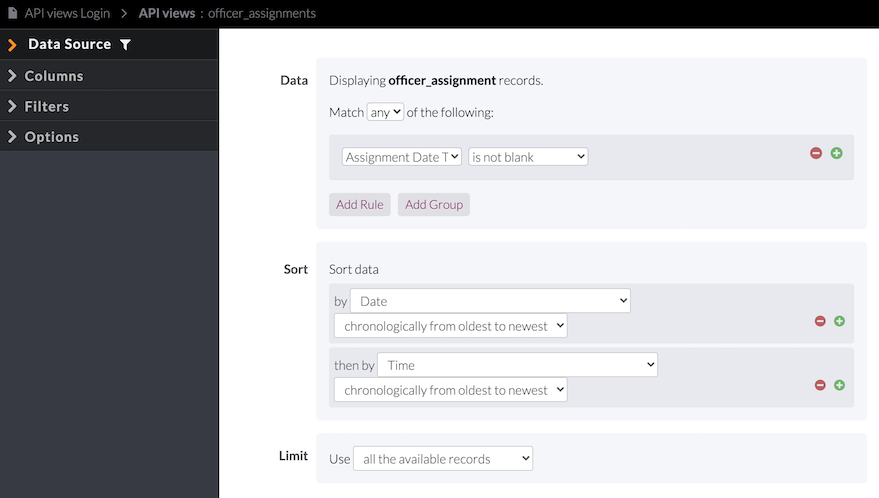

# Update app-specific details in the custom JS upon creating a new app instance

When adding this code to a new instance, the following variables defined in the `appSpecifics` object must be updated.

- `knackAppId` must be updated with the Application ID. This can be found in the Knack Builder view settings cog dropdown > API & Code > API tab.
- `apiTableScene` and `apiTableView` must be updated to reflect the API scene and view IDs that exposes the `officer_assignment` records in the UI. More details about this API view can be [below](#create-API-view-for-fetching-officer_assignments). **Before creating a new API view, be sure to check if one exists already. A copied instance will already have this view present.** The scene and view IDs can be found in the URL of this API view in the Knack Builder UI.
- The record ID for the "No officer assigned" officer. This officer is associated with `officer_assignments` when no officer has signed up for an assignment, and it is necessary for the UI to show which `officer_assignments` are available to users. It is populated in `field_704_raw` of an officer assignment record. **If this is not updated, it will appear as if all assignments are unavailable (grayed out).** This ID can be found by looking at the payload received in the "Available Assignments" view and finding a record with a value of `{identifier: "No Officer Assigned", id: "<the record id>"}` for `field_704_raw`. This value can then be added for the key named `noOfficerAssignedId`.

# Sign up / Available Assignments (scene_208) and Cancel My/Future Assignments (scene_180)

## Custom table and sign up/cancel buttons (view_466) and cancel-only buttons (view_439 and view_447)

### Creating groups of assignments for the UI workflow

To group officer assignments into shifts, there are two steps executed in the custom JS.

1. In the first step, an object is created with keys that are `field_724` (Officer Shift Label) and values that are arrays of records with that shift label. This step is carried out by the `groupRecordsIntoAssignments` function.

```
{
  "01/04/2021 - Vision Zero - Morning - Team 1": [
    {
      field_131: 4540,
      field_131_raw: 4540,
      field_133:
        "<span class='5ff346135a9530001c918c50'>01/04/2021 01:00 to 03:00</span>",
      field_133_raw: [
        {
          id: "5ff346135a9530001c918c50",
          identifier: "01/04/2021 01:00 to 03:00",
        },
      ],
      field_139: "01:00 to 03:00",
      field_139_raw: {
        date: "01/04/2021",
        date_formatted: "01/04/2021",
        hours: "01",
        minutes: "00",
        am_pm: "AM",
      },
      field_154: "01/04/2021 01:00 to 03:00",
      field_154_raw: {
        date: "01/04/2021",
        date_formatted: "01/04/2021",
        hours: "01",
        minutes: "00",
        am_pm: "AM",
      },
      field_205: "01/04/2021",
      field_205_raw: {
        date: "01/04/2021",
        date_formatted: "01/04/2021",
        hours: "12",
        minutes: "00",
        am_pm: "AM",
      },
      field_560: "",
      field_561: "",
      field_584: "",
      field_656:
        "<span class='5fb542c53cf306067bb049d6'>Adam - Signal -  ANDERSON MILL RD / MILLWRIGHT PKWY (OLSON DR)</span>",
      field_656_raw: [{ id: "5fb542c53cf306067bb049d6" }],
      field_669: "",
      field_669_raw: [],
      field_671: "",
      field_704:
        "<span class='5ebef4d0682bfc0015c9e0f4'>No Officer Assigned</span>",
      field_704_raw: [
        { id: "5ebef4d0682bfc0015c9e0f4", identifier: "No Officer Assigned" },
      ],
      field_711: "No",
      field_711_raw: false,
      field_712: "",
      field_724: "01/04/2021 -  Vision Zero - Morning  - Team 1 ",
      field_724_raw: "01/04/2021 -  Vision Zero - Morning  - Team 1 ",
      field_734: 0,
      field_734_raw: 0,
      id: "5ff3560dfdfd9c0675256e85",
    },
    ...<Other records>
  ],
}
```

2. Once the assignments are grouped by `field_724` (Officer Shift Label), the next step organizes these nested array values into nested arrays that contain sets of replicates. Replicates exist because, for each shift, multiple officers can sign up for the same assignments to form teams. Although these replicates records share some properties, each `officer_assignment` record has a unique identifier so that it can be associated with a single officer. This grouping is necessary to enable a single button in the UI to handle sign up for multiple `officer_assignments` by one officer. This step is carried out by the `buildAndAppendShiftSection` function.

```
// First dimension is officer_assignments with same label (grouped in the first step)
// Second dimension is array of officer_assignments within shift (grouped in the second step)
// [A,A,B,B,C,C] => [[A,B,C], [A,B,C]]
//      ^               ^        ^
//  All assignments    1st      2nd
//  (all replicates)  button   button
```

### Create API view for fetching `officer_assignments`

1. Add new page and title it "API views" and use the following settings


2. In the `officer_assignments` table settings within the API view page, make sure the following columns are present in the table:

- Assigned Officers ID
- Assigned Officer
- Assignment Date Time
- Officer Assignment Date Time
- Location
- Time
- Officer Shift Label
- Date
- Remove from My Assignments
- Remove From My Assignments Date and Time
- Reason for Cancellation
- Unassigned Officer
- Status
- Start Time
- End Time
- Number of Observations
- Send email action **(this column is setup in Step 4)**


3. In the `officer_assignments` table settings, add the following data and sort parameters in the "Data Source" tab.

- **Data:** Assignment Date Time is not blank
- **Sort:** by Date chronologically from oldest to newest then by Time chronologically from oldest to newest

**These options are crucial for the custom JS to group `officer_assignments` together into Officer Shifts for the sign up buttons on the front end.**



4. In the `officer_assignments` table settings, add an action link by selecting: Columns > Links > Trigger an action. Use the following settings. The email title and body can be customized as needed with free text and `officer_assignment` fields specific to the record in the table.


### Triggering the action links in the `officer_assignments` API view table

1. Within the custom JS, the action links can be triggered by sending a `PUT` request to the `officer_assignments` API view with the expected payload. **The `PUT` request endpoint URL must include the record id as shown below since this request triggers an email with details specific to a `officer_assignment` record.**

```
var putUrl =
    "https://api.knack.com/v1/pages/" +
    appSpecifics.apiTableScene +
    "/views/" +
    appSpecifics.apiTableView +
    "/records/";

// This payload was developed from observing the request and payload sent by Knack
// after clicking an action link added to an app view.

var payload = {
    action_link_index: 0,
    id: recordId
};

$.ajax({
    url: putUrl + recordId,
    type: "PUT",
    data: JSON.stringify(payload),
    headers: headers,
    success: function (res) {
        console.log(res);
    }
});
```
