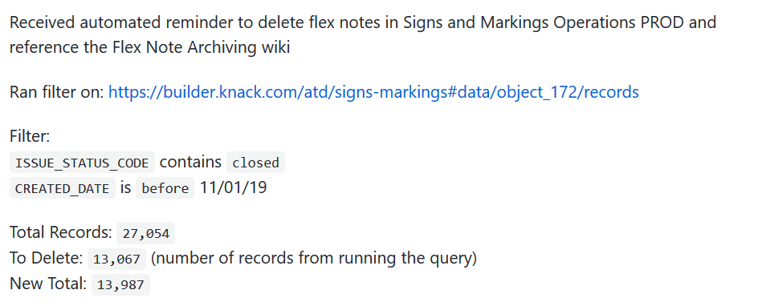
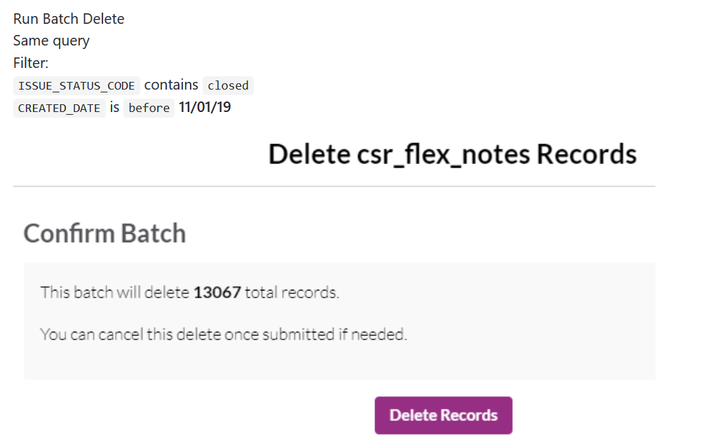

# CSR \| Flex Note Archiving

## Background

When we receive a 311 Service Requests record from our CSR integration, we also receive related "Flex Notes" which contain additional SR attributes specific to each SR type.

An SR can have as many as seven or eight flex notes, so they start to account for many thousands of records in the Data Tracker.

To save storage space, we have a python script which copies all flex notes to our PostgreSQL/PostgREST database.

### Script Location

That script lives here: [https://github.com/cityofaustin/transportation-data-publishing/blob/master/transportation-data-publishing/data\_tracker/knack\_postgrest\_pub.py](https://github.com/cityofaustin/transportation-data-publishing/blob/master/transportation-data-publishing/data_tracker/knack_postgrest_pub.py)

With the flex notes backed up, we have agreed with business owners that we will **delete** the flex note records from the Data Tracker.

Flex notes can be deleted under these conditions:

* The service request is in a **Closed** status
* The service request is **more than two months old**

### Retreive Flex Notes

In the event that a user wants to view any flex notes which are no longer in the Data Tracker, we have two options:

* a user can use the 311 CSR system to view the record.
* a DTS team member can query our database to extract the flex records.

### Delete flex notes from Data Tracker

1. Login to production data tracker builder
2. Navigate to the `csr_flex_notes` object.
3. As a validation check, we first filter the object to see how many records will be deleted. Use the object filters to select records that meet the following criteria:
4. `ISSUE_STATUS_CODE` contains closed
5. `CREATED_DATE` is before `<two months ago>`
6. After applying the filters, verify that the results appear as expected, and _note how many records will be deleted_.
7. Now it's time to batch delete the flex note records. From the `csr_flex_notes` records view in the builder, click on the **Delete** drop-down, and choose **Batch Delete**
8. Apply the same filters as defined in step 3, and click **Next**. On the next screen you will be prompted to confirm the delete. Verify that the \# of records to be deleted matches the results from step 4.
9. Click **Delete Records** to confirm your delete.
10. Lastly, update the [DTS Change Log](http://atd.knack.com/dts#change-log/) and note how many records were deleted.

### Document GitHub Issue

We have a template to use in the atd-data-tech repo

