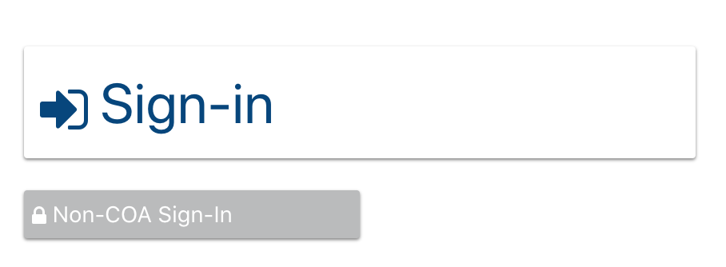
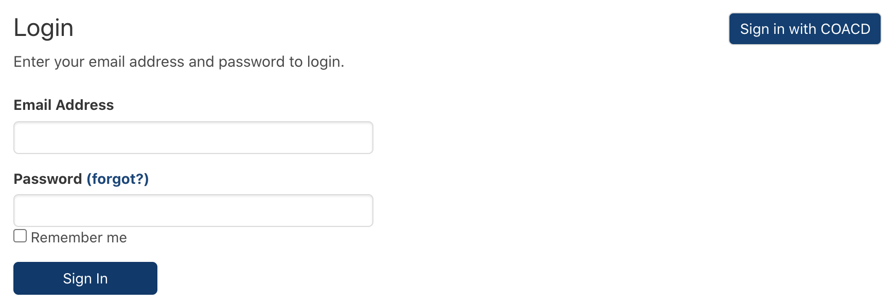

# CODE: Custom Login Buttons



### Adding the custom code to the Knack application

This code will replace the default Knack single sign-on button and login form shown below with the buttons shown above. In the above experience, the form shown below will only appear if a user clicks the button titled **Non-COA Sign-In**.



### The JS


This code uses the custom Knack functionality from the custom Big Button code. Prior to adding this code, add the JS and CSS code from [**CODE: Knack Functionality > Big Buttons**](https://atd-dts.gitbook.io/atd-knack-operations/knack-code/functionality/big-buttons).


The purpose of this code is to find the Knack default single-sign on button and its Knack view ID in the [DOM](https://developer.mozilla.org/en-US/docs/Web/API/Document\_Object\_Model), replace the button with the buttons shown above, and then hide the default Knack login form unless the user clicks the **Non-COA Sign-In** button. This code also lives in the [common folder in the atd-knack GitHub repository](https://github.com/cityofaustin/atd-knack/tree/master/code/common/custom-login-button).

```
/**
 * Enhance SSO button and hide/show default Knack login form with buttons
 * @parameter {string} viewId - Knack view id to append button link to
 */
function customizeLoginButton(viewId) {
  // Hide Knack default SSO button, login form, login title, and any other children
  $("#" + viewId)
    .children()
    .hide();

  var url = Knack.url_base + Knack.scene_hash + "auth/COACD";

  // Create a div for Login buttons
  var $coacdButton = $("<div/>", {
    id: "coacd-button-login",
  });
  $coacdButton.appendTo("#" + viewId);

  // Append Big SSO Login button and non-SSO Login button
  bigButton("coacd-big-button", "coacd-button-login", url, "sign-in", "Sign-In")

  $coacdButton.append(
    "<a class='small-button' href='javascript:void(0)'>" +
      "<div class='small-button-container'><span><i class='fa fa-lock'></i></span><span> Non-COA Sign-In</span></div></a>"
  );

  // On non-SSO button click, hide SSO and non-SSO buttons and show Knack Login form
  var $nonCoacdButton = $(".small-button");
  $nonCoacdButton.click(function () {
    $("#" + viewId)
      .children()
      .show();
    $(".small-button-container,.big-button-container").hide();
    $(".kn-sso-container").hide();
  });
}

// Call customizeLoginButton on any view render to customize any login page that renders in app
$(document).on("knack-view-render.any", function (event, page) {
  // Find SSO button and existing custom button
  var $ssoButton = $(".kn-sso-container");
  var $coacdLoginDiv = $("#coacd-button-login");

  // If SSO button exists on page and there isn't already a custom button
  if ($ssoButton.length && !$coacdLoginDiv.length) {
    var $ssoView = $ssoButton.closest("[id^=view_]");
    var viewId = $ssoView.get(0).id;

    customizeLoginButton(viewId);
  }
});
```

### The CSS - Small Buttons

This styles the smaller Non-COA Sign-In button. Do not duplicate this code if already in your app

```
/***************************************/
/************ Small Buttons ************/
/***************************************/
.small-button-container {
  padding: 5px 10px;
  margin: 10px;
  border-radius: 4px;
  box-shadow: 0px 1px 2px 0px gray;
  font-size: 1em;
  max-width: 15em;
  background-color: #babbbc;
  color: white;
}

.small-button-container:hover {
  background-color: #4c4c4c;
  cursor: pointer;
}

.small-button-disabled {
  background-color: #f7f7f7;
  opacity: 0.6;
}

a.small-button {
  text-decoration: none;
}
```

&#x20;
