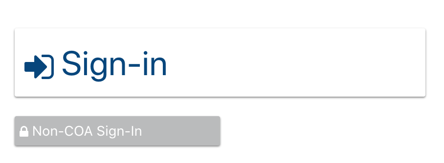
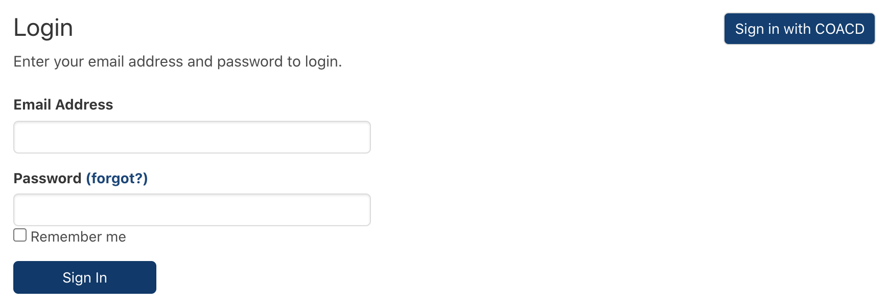
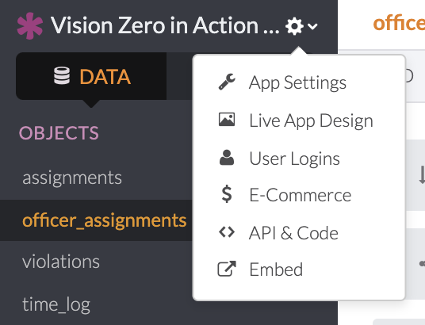
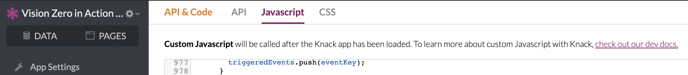

# CODE: Custom Login Buttons


HELP, THIS IS NEEDS TO UPDATE!!




### Adding the custom code to the Knack application

This code will replace the default Knack single sign-on button and login form shown below with the buttons shown above. In the above experience, the form shown below will only appear if a user clicks the button titled **Non-COA Sign-In**.



### Steps

Navigate to the settings cog on your application, click **API & Code**.



In the API & Code view, **Javascript** and **CSS** tabs can be selected to see text fields where custom code can be added. 




Prior to adding any code to a Knack application, check the existing code to see if any of the code that you are adding is already present. For example, the login button in this procedure uses the same CSS code as the **Big Buttons** and is not needed twice.


In the text field under the **Javascript** tab, paste the following code. The purpose of this code is to find the Knack default single-sign on button and its Knack view ID in the [DOM](https://developer.mozilla.org/en-US/docs/Web/API/Document_Object_Model), replace the button with the buttons shown above, and then hide the default Knack login form unless the user clicks the **Non-COA Sign-In** button. 

```text
$(document).on("knack-view-render.any", function (event, page) {
  // Find SSO button and existing custom button
  var $ssoButton = $(".kn-sso-container");
  var $coacdLoginDiv = $("#coacd-button-login");

  // If SSO button exists on page and there isn't already a custom button
  if ($ssoButton.length && !$coacdLoginDiv.length) {
    var $ssoView = $ssoButton.closest("[id^=view_]");
    var viewId = $ssoView.get(0).id;

    customizeLoginButton(viewId);
  }
});

function customizeLoginButton(viewId) {
  // Hide Knack default SSO button, login form, login title, and any other children
  $("#" + viewId)
    .children()
    .hide();

  var url = Knack.url_base + Knack.scene_hash + "auth/COACD";

  // Create a div for Login buttons
  var $coacdButton = $("<div/>", {
    id: "coacd-button-login"
  });
  $coacdButton.appendTo("#" + viewId);

  // Append Big SSO Login button and non-SSO Login button
  $coacdButton.append(
    "<a class='big-button' href='" +
      url +
      "'><div class='big-button-container'><span><i class='fa fa-sign-in'></i></span><span> Sign-in</span></div></a>"
  );

  $coacdButton.append(
    "<a class='small-button' href='javascript:void(0)'>" +
      "<div class='small-button-container'><span><i class='fa fa-lock'></i></span><span> Non-COA Sign-In</span></div></a>"
  );

  // On non-SSO button click, hide SSO and non-SSO buttons and show Knack Login form
  var $nonCoacdButton = $(".small-button");
  $nonCoacdButton.click(function () {
    $("#" + viewId)
      .children()
      .show();
    $(".small-button-container,.big-button-container").hide();
    $(".kn-sso-container").hide();
  });
}
```

In the text field under the **CSS** tab, paste the following code. The purpose of this code is to style the buttons that the Javascript code generates to look as shown above.

```text
/* Big Buttons */
.big-button-container {
  border-radius: 2px;
  box-shadow: 0px 1px 2px 0px gray;
  font-size: 2.5em;
  padding: 10px;
  margin: 20px;
  max-width: 12em;
}

.big-button-container:hover {
  background-color: #f7f7f7;
  cursor: pointer;
}

.fa {
  vertical-align: baseline;
}

a.big-button {
  text-decoration: none;
}

/* Small Buttons */
.small-button-container {
  padding: 5px;
  margin: 20px;
  border-radius: 2px;
  box-shadow: 0px 1px 2px 0px gray;
  font-size: 1em;
  max-width: 15em;
  background-color: #babbbc;
  color: white;
}

.small-button-container:hover {
  background-color: #4c4c4c;
  cursor: pointer;
}

a.small-button {
  text-decoration: none;
}
```

 

