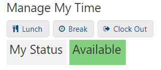

# CODE: Highlight Details Widget Field Body

You may want to highlight that field to visibility see the field better on the page

If you have a several fields in the details widget, example `Status` field



```text
function changeFieldColor(field, color_map) {
  var child_field = $(field).find(".kn-detail-body");
  var value = child_field.text();
  if (color_map[value]) {
    $(child_field).css({
      "background-color": color_map[value].background_color,
      color: color_map[value].color
    });
  }
}

// Change table data background colors 
function changeTableFieldColor(field, color_map) {
  var fields = $(field);
  fields.each(function() {
    var value = this.innerText;
    if (color_map[value]) {
      $(this).css({
        "background-color": color_map[value].background_color,
        color: color_map[value].color
      });
    }
  });
}

var colorMapOne = {
  "Available": { background_color: "#80d07e", color: "#fff" },
  "Unavailable": { background_color: "#ff9b9c", color: "#fff" }
};

// Color map for Status highlighting
var colorMapServiceRequestsStatus = {
  "Unavailable": { background_color: "#ff9b9c", color: "#fff" }
};

$(document).on("knack-scene-render.any", function() {
  // Details Status
  changeFieldColor(".field_236", colorMapOne);

});
```

You can change the HEX colors to match the statuses

```text
  "Available": { background_color: "#80d07e", color: "#fff" },
  "Unavailable": { background_color: "#ff9b9c", color: "#fff" }
```

Make sure to find the field you want to highlight and find it's field ID, ex. `.field_236`

```text
 changeFieldColor(".field_236", colorMapOne);
```


