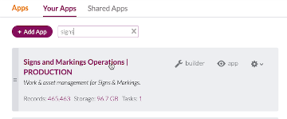
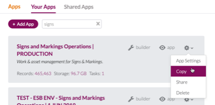
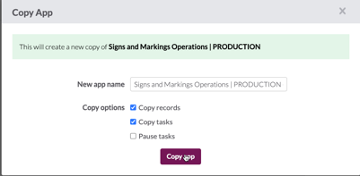
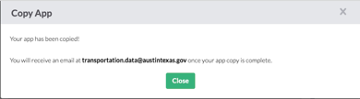
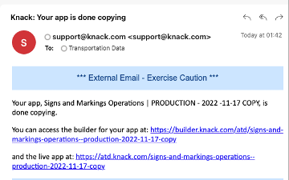
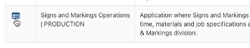
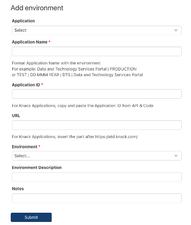

# Copy an Application

* **Notify the Apps Team using the Slack channel `atd-knack.`**

<figure><figcaption></figcaption></figure>

* &#x20;**Log into Knack Builder using the Transportation Data Enterprise account (Knack Builder – Primary Account) using 1Password.**
* **Search for the application you want to copy.**

<figure><figcaption></figcaption></figure>

* **From the gear icon dropdown, select Copy.**

<figure><figcaption></figcaption></figure>

* **Change the new app name and pause tasks (if applicable).**\
  Knack will automatically append Copy to the end of the name. Edit this out and use the format  PRODUCTION or TEST | DD MMM YYYY | \[APPLICATION NAME].

<figure><figcaption></figcaption></figure>

* **An immediate confirmation will display.**&#x20;

<figure><figcaption></figcaption></figure>

* **Copying the app will take time.** \
  Knack will send an email to the Transportation Data Enterprise account when done.\
  You may want to let the service desk primary know that you’re expecting the email confirmation from Knack.

<figure><figcaption></figcaption></figure>

* **Add the new environment to the** [**DTS Portal listing of applications**](https://atd.knack.com/dts#applications)**.**  \
  Select the PRODUCTION environment you have copied and **Add Environment**. &#x20;

<figure><figcaption></figcaption></figure>

* **Add the details about the new environment.**\
  To find the Application ID, go to the app > Settings > API and Code.

<figure><figcaption></figcaption></figure>

* **IF APPLICABLE: Delete the old environment from Knack and add Date Deleted to the DTS Portal record.**
