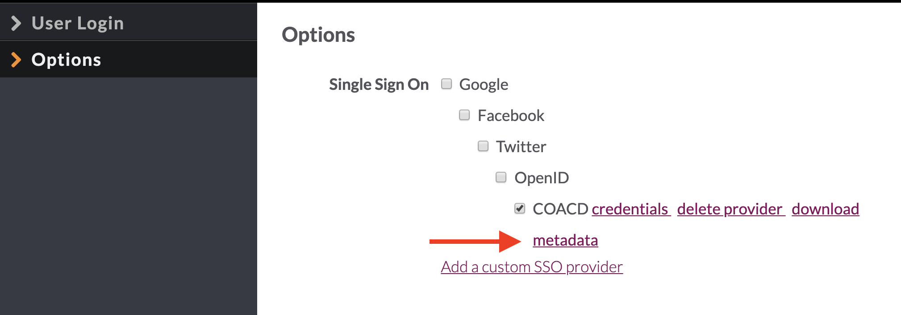
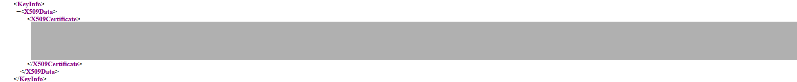

# Single Sign On

## Knack supports Active Directory Single Sign On \(SSO\). 

At a high level, the process looks like this:

1. Configure the Knack custom login with our \(DTS\) signing certificates
2. Send the login metadata to CTM. 
3. CTM will install our metadata and provide their own provider metadata back to us.
4. Update the Knack custom login with information from the CTM metadata.

### Configuring the Custom SSO Provider in Knack


If you need to generate a new certificate \(because the current cert has expired, for example\), see our [wiki entry](https://atd-dts.gitbook.io/atd-knack-operations/knack/single-sign-on/ssl-certificate-management) for instructions. Note that as a best practice we use the same certificate across all knack apps. So, if you do need to generate a new certificate, you should do this for every Knack application. Consult the application team before embarking on this.


1. Open the Knack builder and navigate to the login page where you want to add ADFS. Click on the `Login` form to bring up the editing interface.
2. From the `Options` tab, click on the link to `Add a custom SSO provider`. Complete the fields as follows:

#### **Provider type**

> SAML 1.1 or 2.0

#### **Provider Entry Point**

This field is required in order to proceed, but it may change later on in the process. For now, use `https://login.microsoftonline.com/5c5e19f6-a6ab-4b45-b1d0-be4608a9a67f/saml2`

**Issuer**

This needs to uniquely and globally identify your app, and it must not change. So, use the base URL for your app. E.g.:

> `atd.knack.com/your-app-name`.

#### **Identity Provider's certificate**

> Leave this blank, for now

**Private signing certificate**

> Leave this blank

**Decryption private certificate & Decryption public certificate**


These steps ensure that the certificate information is properly formatted to meet Knack's expectations


Locate our self-signed SSL \(X.509\) certificate for your app. It is stored in 1Password as _Self-Signed x509 SSL Certificates for SAML/ADFS._ 

Start by copying our **Private Key** from _1Password_, and paste it into the [Private Key formatter](https://www.samltool.com/format_privatekey.php). Click the "Format Private Key" button to format the key, and copy the contents of output box labeled "Private Key with header".

Now copy and paste the formatted private key into the **Decryption private certificate** field in the Knack login config.

Now copy our **Public Certificate** from _1Password,_ and paste the key into the [X509 Formatter](https://www.samltool.com/format_x509cert.php).  Click the "Format X.509 Certificate" button, then copy the contents of output box labeled "X.509 cert with header". Paste the formatted certificate into the **Decryption public certificate** field in the Knack login config.

**Logout URL**

> Blank

**Authentication Context**

> Select `urn:oasis:names:tc:SAML:2.0:ac:classes:PasswordProtectedTransport`

**ID Property**

> `http://schemas.xmlsoap.org/ws/2005/05/identity/claims/emailaddress`
>
> \`\`[`http://schemas.microsoft.com/ws/2008/06/identity/claims/windowsaccountname`](http://schemas.microsoft.com/ws/2008/06/identity/claims/windowsaccountname) `(for VZA)`

#### First Name Property

> Blank

#### Last Name Property

Blank

#### Email Address Property

> http://schemas.xmlsoap.org/ws/2005/05/identity/claims/emailaddress
>
> or Blank

Click "Submit" to save the custom login, then click "Save Changes" again to save your changes to the Knack login form.

### Coordinate  Setup with CTM

Now that you have configured the customer SSO provider in Knack, you will need to send CTM our application's SAML metadata. 

Open the Knack builder and navigate to the login page where you configured the SSO provider. Click on the `Login` form to bring up the editing interface. 

From the `Options` tab, your custom SSO provider should be listed. Click the **Download Metadata** link and save your applications login metadata locally.

Log into the City's [ServiceNow Portal ](https://atx.service-now.com/sp) and create a request indicating that you want to set up `Active Directory` on an application. Attach your copy of the Knack application meta data to your request. 

### Updating Login Config with CTM Metadata

CTM  will eventually respond to your service request and provide you with their ADFS login metadata xml.  With this in hand, navigate back to the custom SSO provider setup form in the Knack builder.

In CTM's metadata, find the provider certificate in the metadata under the `Signature tag`, then the `KeyInfo` tag, then the `X509Certificate` tag. 


If you can’t figure out which cert to pull from the metadata, just ask CTM directly for their ADFS certificate.


Copy and paste the contents of the `X509Certificate` tag into the [X509 Formatter](https://www.samltool.com/format_x509cert.php). Click the "Format X.509 Certificate" button, then copy the contents of output box labeled "X.509 cert with header". Paste the formatted certificate into the **Identity Provider's certificate** field in the Knack login config.

You're almost done! 

The last step is to update the **Provider Entry Point** field in case it has changed. In the CTM metadata, find the `<SingleSignOnService>` tag and copy the  URL from its `Location` attribute. It should look something like this: 

> `https://login.microsoftonline.com/5c5e19f6-a6ab-4b45-b1d0-be4608a9a67f/saml2`

Paste that url into the **Provider Entry Point** field in the Knack config. Click **Submit** to save your changes, then click **Save Changes** to really really save your changes.

That's it. You're done!

Note - If you see this error \(_AADSTS50011: The reply URL specified in the request does not match the reply URLs configured for the application: 'atd.knack.com/_'\), write back to CTM and ask them to update the Azure Instance \(ACS URL\) with the US included in the URL.

