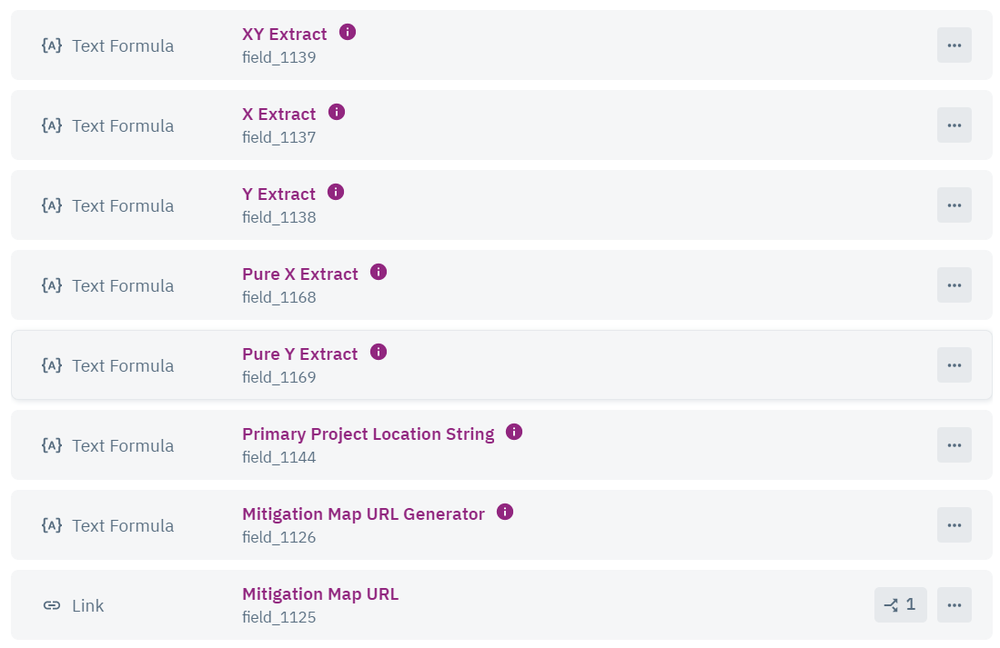

# COS JV Update



Select **Import** from the _`cost_of_service_fees` object_

.png>)



CSV includes headers, select **Next**

.png>)



Select **Yes** to update existing records and match _`Fee Number`_ column to the _`Fee Number`_ Knack field and select **Next**

.png>)



Deselect all Knack fields and check _`Fee Number`_ field\

.png>)

and also select _`Journal Voucher ID`_, then select **Next**\




Make sure the number of records importing matches your CSV. Select **Add a default**.\

.png>)



Set _`Import Date`_ to today's date and select **Start Import**\

.png>)

All Done! Complete for each spreadsheet.


