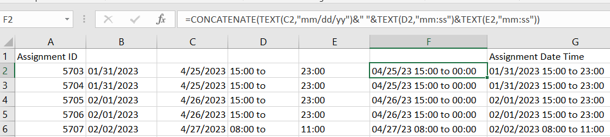

# Calculating Cycle Completion Percentage

#### Required Fields - Parent Object (such as Review Cycle)

* Count - Number of Child Object Records (such as Review Comments)
* Count - Number of Completed Child Object Records
* Equation - Cycle Completion Percentage


For this Equation, we set the Equation Type to Numeric, set a Period with 0 Decimal places, and Number Format to %


**Equation Example**

We divide the completed child records by the total amount of connected child records to give us a percentage that we can show on the parent object. In this example, we take the number of Review Cycle Comments with a 'Review Complete' status and divide it to get our Completion % as shown below.

<pre><code><strong>{Number of Review Cycle Comments Completed}/{Number of Review Cycle Comments}
</strong></code></pre>

<figure><figcaption>
Completion % as shown for multiple parent records
</figcaption></figure>
